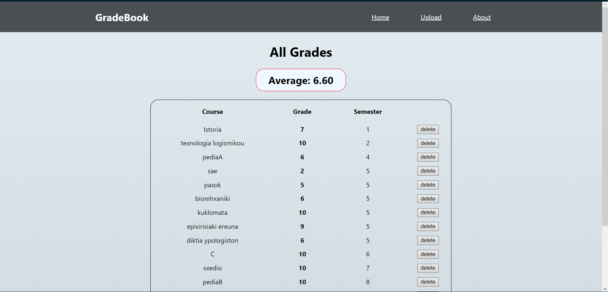

# GradeBook 
> A simple web app where you can calculate the <i>Αverage</i> for your university courses

  

 Οδηγίες εγκατάστασης εφαρμογής 

1) Κάνoυμε `https://github.com/john-papani/Gradebook.gitt`
2) Εγκαθιστούμε (τοπικά) την [βάση](https://github.com/john-papani/Gradebook/blob/master/gradebook.sql) μας
3) `cd backend` -> `npm install ` και έπειτα `npm start`
4) `cd frontend` -> `npm install ` και έπειτα `npm start`
5)Επισκεπτόμαστε την ιστοσελίδα [localhost:3000](http://localhost:3000) 

---
### Technologies used

##### [Back-end](https://github.com/john-papani/Gradebook/tree/master/backend)
* Node.js/npm
- WebStorm 

##### [Front-end](https://github.com/john-papani/Gradebook/tree/master/frontend) (_Javascript_)
* ReactJS
- WebStorm

---
